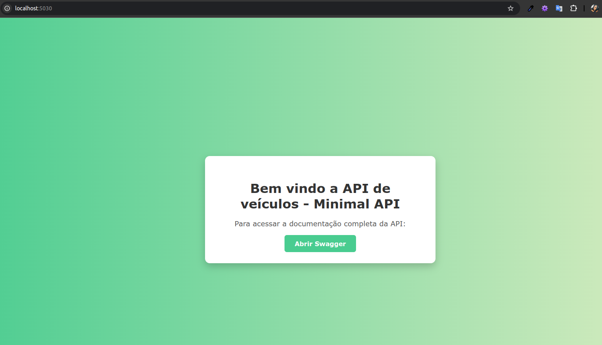
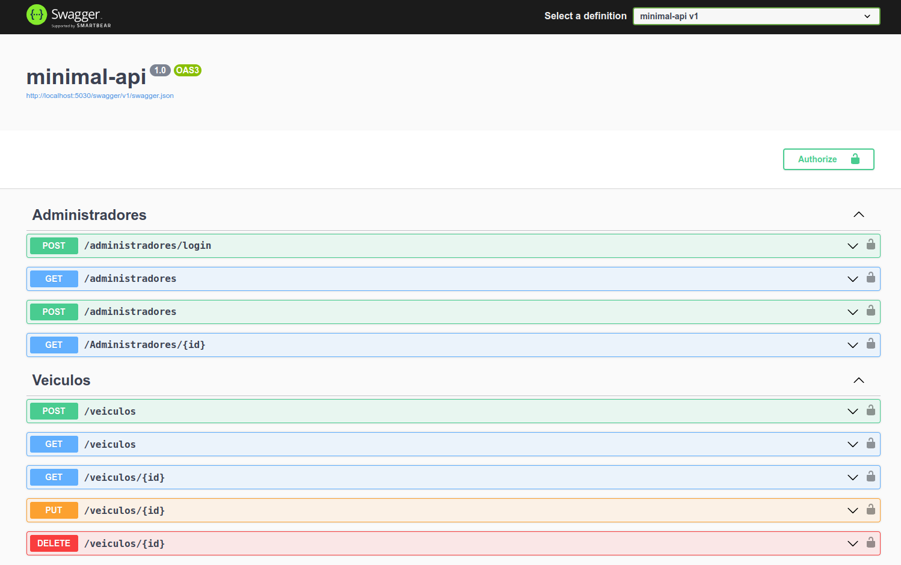

# Minimal API com JWT e MySQL


<br>

### 📍 **Destaques do Projeto**
- CRUD completo de veículos
- Autenticação via JWT
- Documentação com Swagger
- Página inicial personalizada
- Testes automatizados
- Banco MySQL com Entity Framework Core

<br>

## 📌 Sobre o Projeto

API desenvolvida com **.NET 8**, padrão **Minimal API**, integrada ao **MySQL** e com autenticação via **JWT**.  
O objetivo é fornecer um CRUD completo de veículos, com boas práticas de desenvolvimento, testes unitários e documentação via Swagger.

<br>

## 🚀 Tecnologias Utilizadas

| Tecnologia | Versão | Observação |
|------------|---------|--------------|
| .NET | 8.0 | Minimal API |
| MySQL | 8+ | Banco de dados |
| Entity Framework Core | 8.0.10 | ORM |
| Pomelo MySQL Provider | 8.0.0 | Suporte ao MySQL |
| Swagger (Swashbuckle) | 6.5.0 | Documentação |
| JWT Authentication | 8.0.10 | Segurança |
| MSTest | 3.0.4 | Testes |

<br>

## 🧩 Pré-requisitos

Certifique-se de ter instalado:

- .NET SDK 8+
- MySQL 8+
- IDE ou editor de código (Visual Studio, VS Code ou Rider)

<br>

## ⚙️ Configuração

1. Clone o repositório:

```bash
git clone https://github.com/andreza1freitas/minimal-api.git
```

2. Configure a **connection string** no arquivo appsettings.json:

```json
"ConnectionStrings": { 
    "MySql": "Server=localhost;Database=SeuBanco;Uid=SeuUsuario;Pwd=SuaSenha;"
}
 ```

3. Restaurar dependências:

```bash
dotnet restore
```

4. Criar o banco via EF Migrations:

```bash
dotnet ef database update
```

5. Executando o Projeto:

```bash
dotnet run
```

<br>

## 📘 Documentação Swagger

Para acessar a documentação da API, siga os passos abaixo:

1. Inicie o projeto.
2. Abra o navegador e acesse: [http://localhost:5030](http://localhost:5030)

### Página Inicial


### Swagger
Clique em **Abrir Swagger** para visualizar todos os endpoints da API:


<br>

## ✅ Testes

Para executar os testes automatizados:

```bash
cd Test
dotnet test
```

<br>

## 🧩 Implementações Extras

Além do conteúdo abordado no projeto original, foram desenvolvidos os seguintes recursos adicionais:

- Criação dos testes de unidade para o modelo de Veículo.

- Desenvolvimento da página inicial personalizada para facilitar o acesso à documentação da API.

- Estruturação completa do arquivo README.md com informações do projeto, uso, tecnologias, screenshots e orientações de configuração.

<br>

## 💡 Projeto Original

Este projeto é baseado no projeto original disponibilizado pelo professor **Danilo Aparecido** da Digital Innovation One (**DIO**).  
Você pode acessar o projeto original [clicando aqui](https://github.com/digitalinnovationone/minimal-api).

<br>

## 🧑‍💻 Desenvolvedora

**Andreza Freitas**

Desenvolvido com foco em boas práticas, qualidade de código e arquitetura limpa.


Sugestões e melhorias são bem-vindas. Abra uma issue ou envie um pull request.
